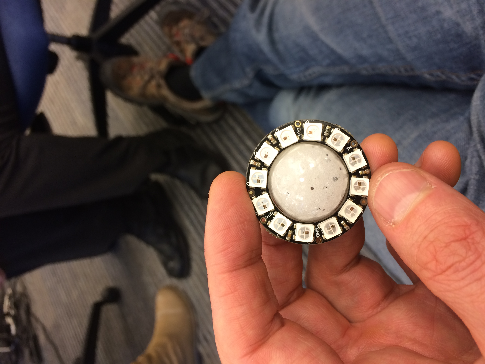
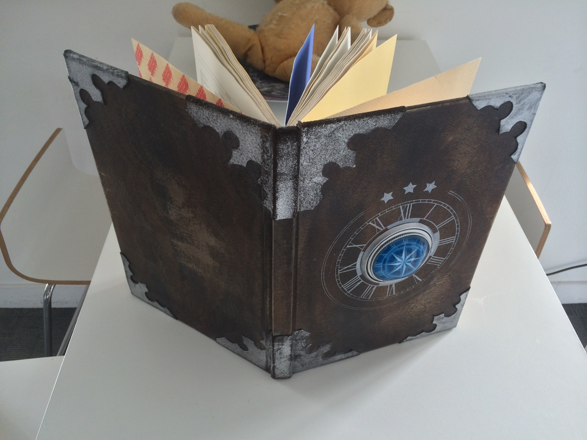

Bead Redesign
=============

We had a design meeting with Alex and he had a great idea to simplify the bead design. If we surround the bead with a neopixel array of 12 then it starts to look like a clock! It actually looks much like the Celestial Atlas. We are going to look at translucent 3D printing techniques to encase the neopixels such that it shows as a clock face. 

